

<h1>中学生学习习惯调查问卷</h1>

1. 您的性别?

2. 你有制定学习计划的习惯吗？

3. 对于课前预习，你是怎么做的？

4. 你通常采用的听课方式？

5. 课上老师提问时你会?

6. 你会经常向老师或同学提出自己的疑问吗？
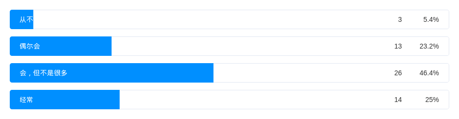
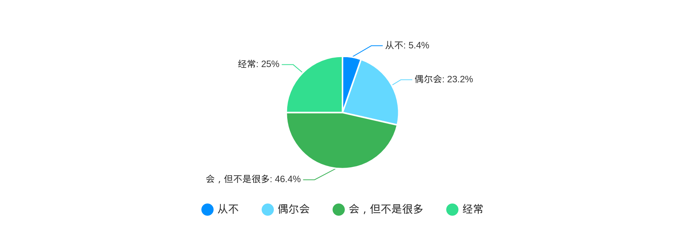
7. 对于复习，你是怎么做的？
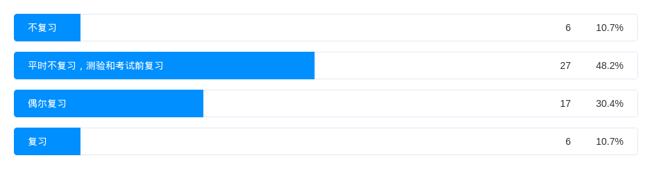
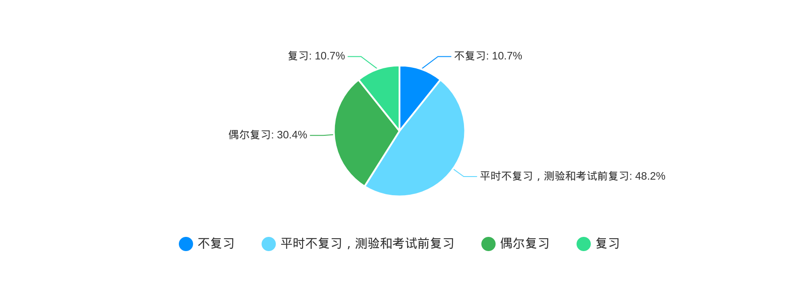
8. 如果老师布置作业让你完成,你会?
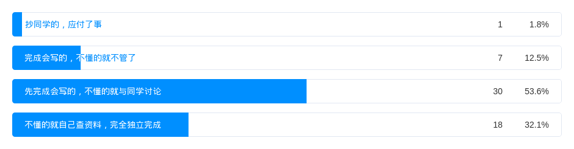
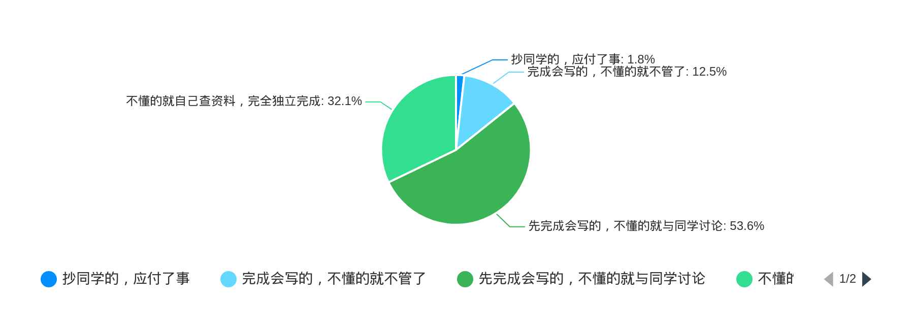
9. 试卷或作业发下来后如何订正呢?
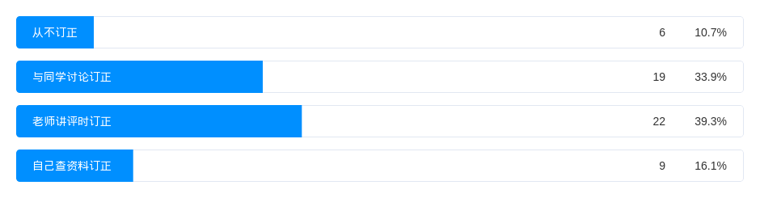
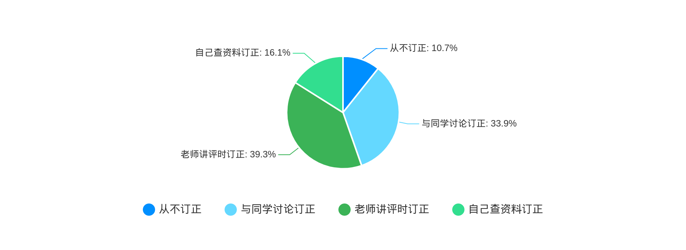
10. 你是怎样处理学科的复习与作业的关系呢?
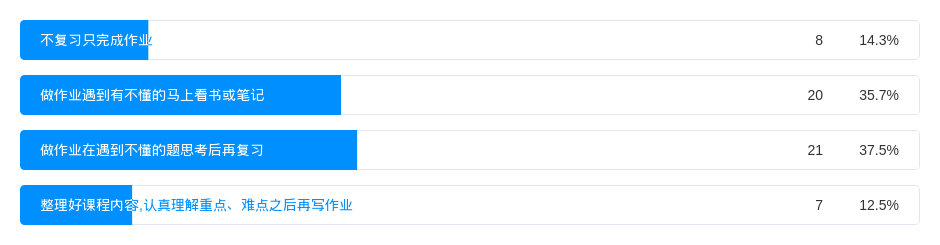
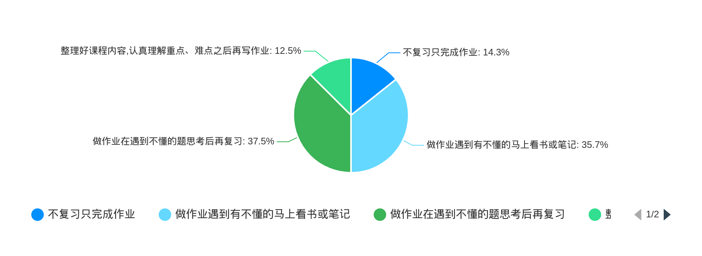
11. 晚自修完成作业后，你通常会?
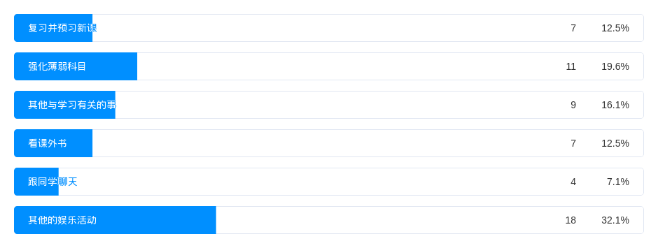
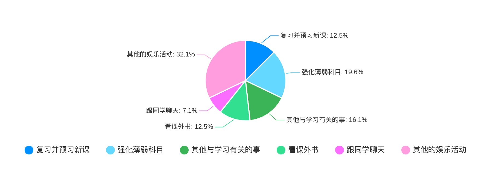
12. 你的作息时间规律吗？
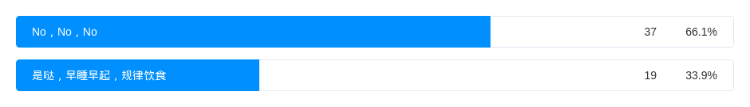
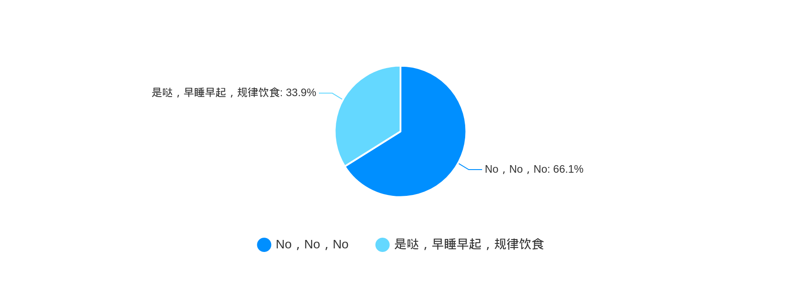
13. 你玩游戏吗？
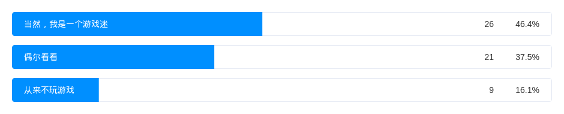
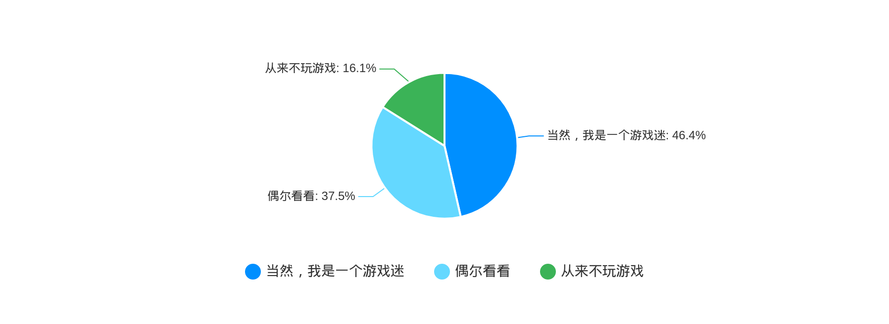
14. 你的学习成绩在年纪的排名？
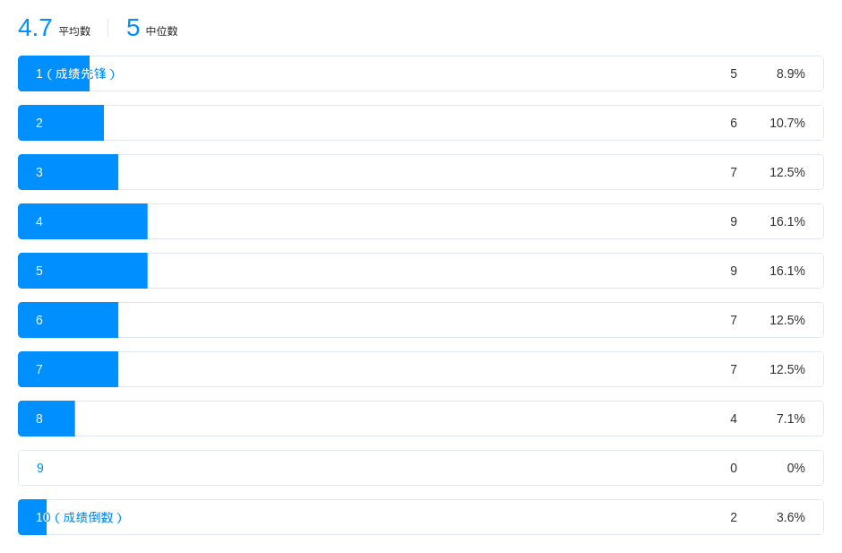
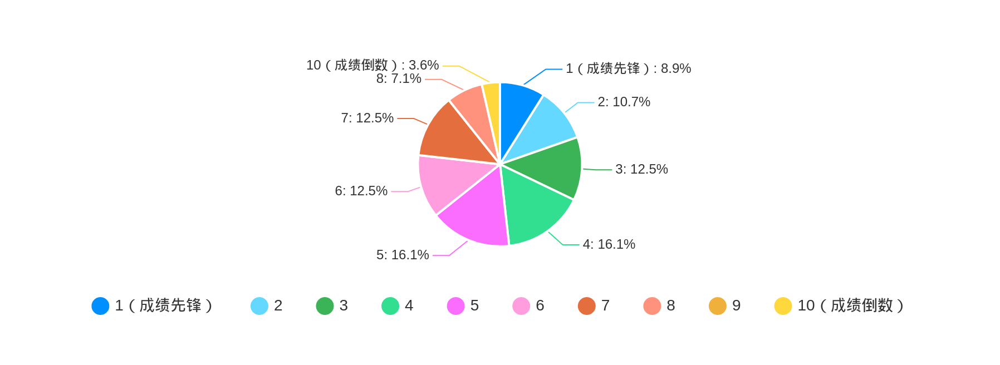
