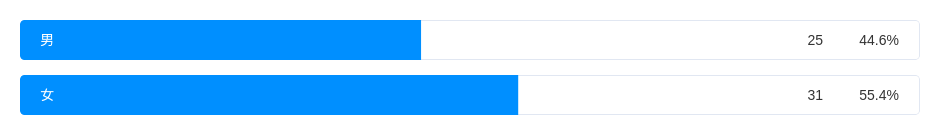
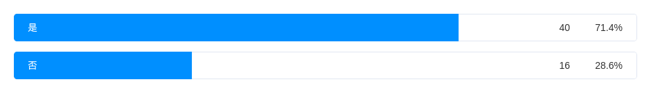
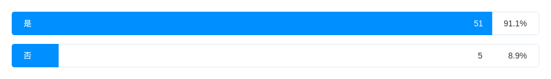
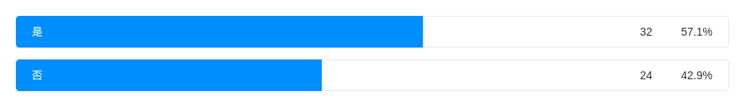
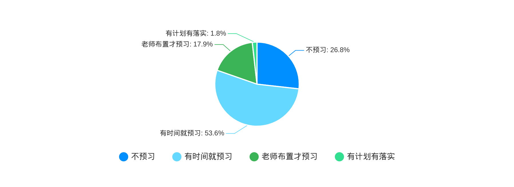
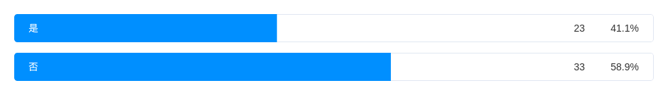
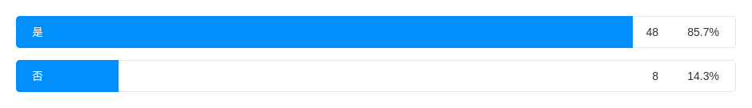
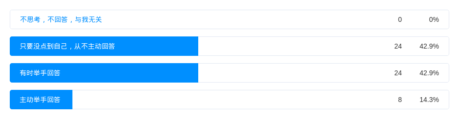
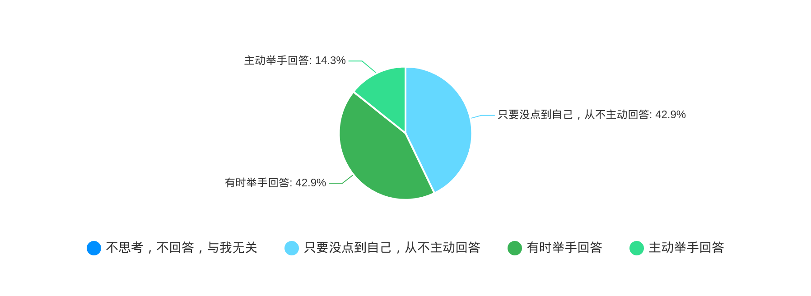

<h1 align="center">中学生学习习惯调查问卷</h1>

1. 您的性别?

2. 你是否有制定学习计划的习惯？

3. 你是否有课前预习的习惯？

4. 在课上，你是否能认真记好笔记？

5. 上课时，你是否能积极回答问题？

6. 有不明白的问题，你是否及时向老师提问？

7. 你是否有课下复习的习惯？

8. 你是否能认真完成作业？

9. 你是否能够及时改正错题？

10. 你的学习成绩在年纪的排名是否达到前70%？

